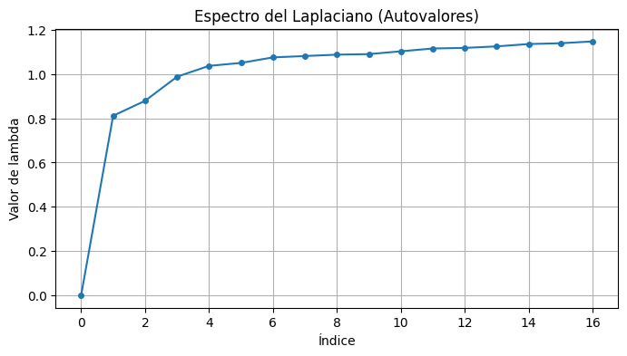
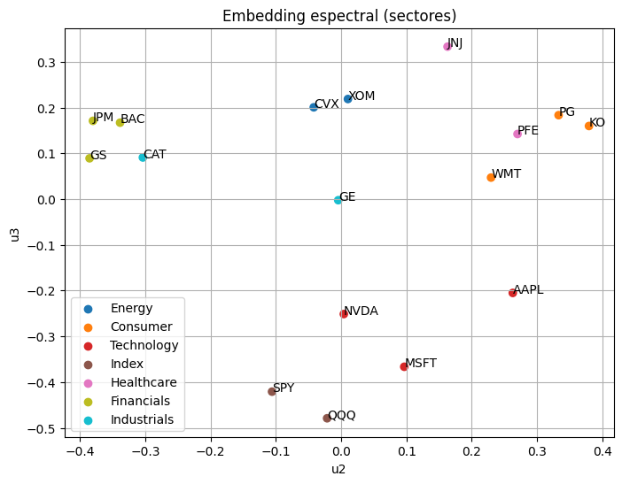
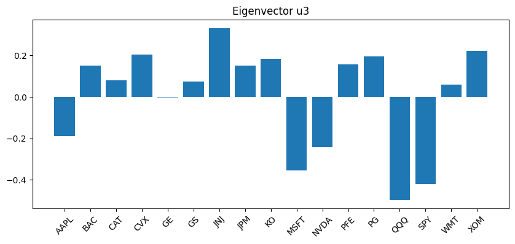
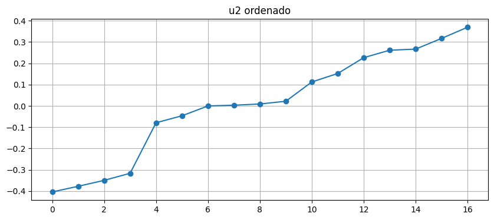
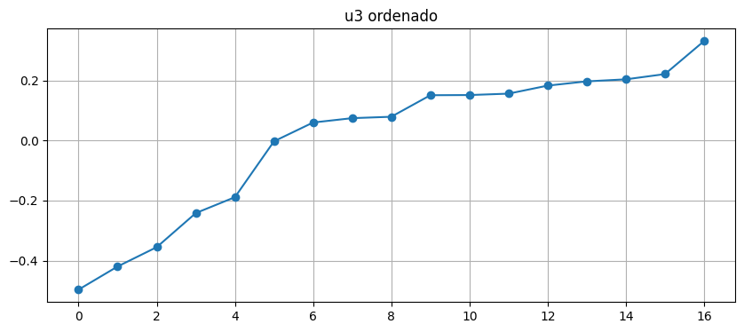
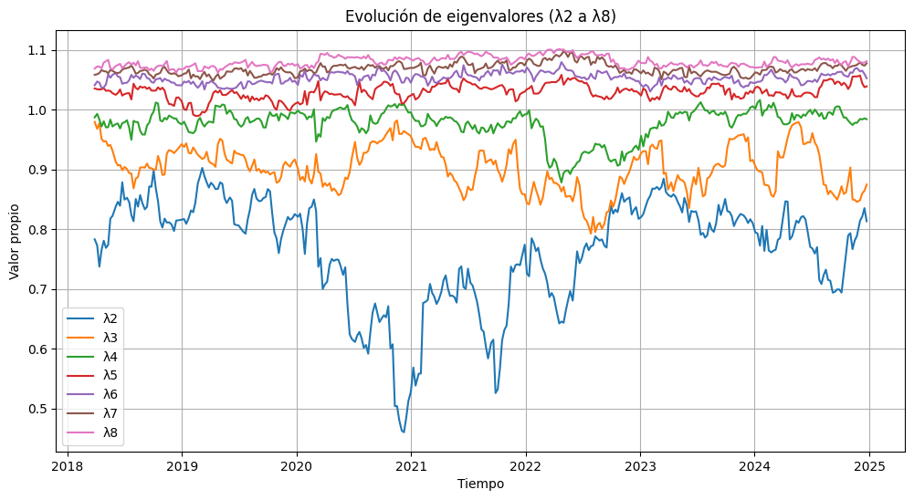
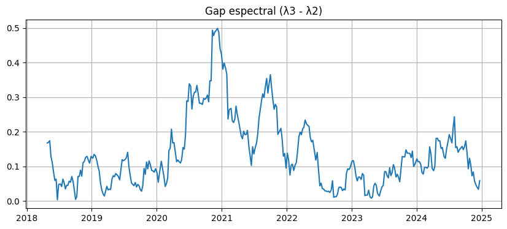
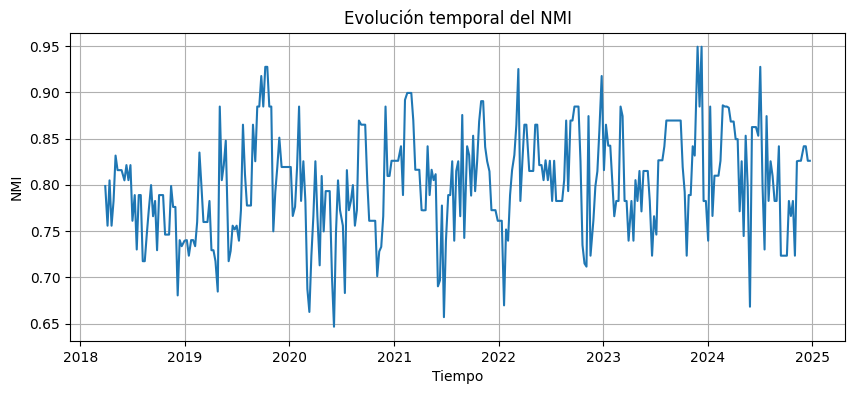

# Teoría Espectral de Gráficas

## Portada
> **Proyecto**: Análisis espectral de la estructura y dinámica de redes financieras.

**Autor**: Dylan Ramírez Hernández

## Índice
1. [Introducción](#1-introducción)
2. [Marco Teórico](#2-marco-teórico)
   
   2.1 [Mercado financiero como red compleja](#21-mercado-financiero-como-red-compleja)  
   2.2 [Operadores Laplacianos y Geometría Espectral](#22-operadores-laplacianos-y-geometría-espectral)
      2.1.1 [El Espectro del Laplaciano y la Estructura de Red](#221-el-espectro-del-laplaciano-y-la-estructura-de-red)
   2.3 [Embedding Espectral y Reducción de Dimensionalidad](#23-embedding-espectral-y-reducción-de-dimensionalidad)  
   2.4 [Estabilidad Espectral](#24-estabilidad-espectral)  
4. [Metodología y Análisis Estático](#3-metodología-y-análisis-estático)

   3.1 [Selección de Datos y Configuración de Parámetros](#31-selección-de-datos-y-configuración-de-parámetros)  
   3.2 [Análisis de la Estructura Estática (Benchmark)](#32-análisis-de-la-estructura-estática-benchmark)  
   3.3 [Métricas de Validación](#33-métricas-de-validación)  
5. [Análisis Dinámico y Transiciones de Régimen](#4-análisis-dinámico-y-transiciones-de-régimen)

   4.1 [Protocolo de Ventanas Móviles (Rolling Windows)](#41-protocolo-de-ventanas-móviles-rolling-windows)  
   4.2 [Estabilidad Temporal y Alineación de Procrustes](#42-estabilidad-temporal-y-alineación-de-procrustes)  
   4.3 [Análisis de la Evolución Espectral](#43-análisis-de-la-evolución-espectral)  
   4.4 [Identificación de Regímenes](#44-identificación-de-regímenes)  
6. [Conclusiones](#5-conclusiones)

---

## 1. Introducción
Contexto del mercado como sistema complejo y el objetivo de identificar transiciones de régimen mediante geometría espectral.

---

## 2. Marco Teórico

### 2.1 Mercado financiero como red compleja

El mercado financiero ha sido ampliamente estudiado desde la perspectiva de la teoría de grafos debido a que las interacciones entre activos generan estructuras de dependencia no triviales. La literatura reconoce que dichas interacciones pueden representarse mediante redes ponderadas, en las cuales los nodos corresponden a entidades financieras o activos, y las aristas codifican relaciones de dependencia o similitud entre ellos (Caccioli, Barucca y Kobayashi, 2018; Cont et al., 2010).

Dado que el universo completo de activos negociables es extremadamente grande, en la práctica el análisis suele realizarse sobre un subconjunto representativo de activos, seleccionado de acuerdo con el objetivo de estudio. Dicho subconjunto induce una red financiera que preserva, al menos de forma local, relaciones estructurales relevantes del mercado.

En el contexto financiero, la dependencia entre activos suele derivarse de la correlación entre sus series de retornos. La aplicación de este concepto es fundamental, dado que la evidencia empírica muestra que las matrices de correlación capturan la estructura jerárquica y la topología interna que subyacen en los mercados financieros (Tumminello, Lillo y Mantegna, 2008).

Sea $V = \{v_1,\dots,v_n\}$ un conjunto de activos con precios $P_i(t)$. Para cada activo $i$, se consideran los retornos logarítmicos definidos por

$$
r_i(t)=\log P_i(t)-\log P_i(t-1)
$$

los cuales representan la variación relativa del precio entre dos instantes consecutivos.

A partir de estas series de retornos, se construye la matriz de correlación de dimensión $n \times n$

$$
\rho_{ij} = \frac{\mathbb{E}[(r_i - \mathbb{E}[r_i])(r_j - \mathbb{E}[r_j])]}{\sqrt{\mathbb{E}[(r_i - \mathbb{E}[r_i])^2]\mathbb{E}[(r_j - \mathbb{E}[r_j])^2]}}
= \mathrm{Corr}(r_i,r_j),
$$

la cual cuantifica el grado de dependencia lineal entre pares de activos.

Desde una perspectiva económica, valores altos de $\rho_{ij}$ indican que los activos tienden a responder de forma similar ante shocks de mercado, factores macroeconómicos o dinámicas sectoriales comunes.

Con el fin de dotar a esta estructura de una interpretación geométrica, la correlación se transforma en una distancia mediante la métrica propuesta por Mantegna (1999):

$$
d_{ij}=\sqrt{2(1-\rho_{ij})}.
$$

Esta expresión se justifica al considerar los vectores de retornos normalizados. Así, la correlación puede interpretarse como el coseno del ángulo entre dos vectores,

$$
\rho_{ij}=\cos(\theta_{ij}),
$$

por lo que la distancia euclidiana entre vectores unitarios satisface

$$
\lVert x_i-x_j\rVert^2 = 2(1-\cos\theta_{ij}),
$$

y, en consecuencia,

$$
d_{ij}=\sqrt{2(1-\rho_{ij})}.
$$

Esta transformación permite reinterpretar las dependencias estadísticas entre activos como distancias geométricas en un espacio latente.

Posteriormente, a partir de la matriz de distancias se construye una matriz de afinidad mediante un kernel gaussiano adaptativo de tipo self-tuning (Zelnik-Manor y Perona, 2004):

$$
W_{ij}=
\exp\left(
-\frac{d_{ij}^2}{\sigma_i\sigma_j}
\right),
$$

donde

$$
\sigma_i = d(i,k\text{-ésimo vecino})
$$

define una escala local asociada a cada nodo.

Esta construcción permite capturar la geometría local de la red sin imponer una escala global fija, lo cual resulta especialmente adecuado en contextos financieros donde la intensidad de las relaciones entre activos puede variar significativamente.

Finalmente, el conjunto de activos y sus afinidades inducen un grafo ponderado

$$
G=(V,E,W),
$$

donde:

- $V$ es el conjunto de nodos (activos),
- $E\subseteq V\times V$ representa las conexiones entre activos,
- $W=(W_{ij})$ es la matriz de pesos que codifica la intensidad de la relación entre pares de activos.

En particular, la estructura de red resulta útil para analizar fenómenos de contagio financiero y acoplamiento sistémico, donde perturbaciones locales pueden propagarse a través de las conexiones del grafo.

Por tanto, la representación del mercado como red compleja constituye la base conceptual sobre la cual se desarrolla el análisis espectral presentado en este trabajo.

### 2.2 Operadores Laplacianos y Geometría Espectral

Una vez definida la matriz de afinidad $W$, la caracterización de la estructura global de una red se realiza a través de los operadores Laplacianos. El Laplaciano permite analizar propiedades geométricas del sistema mediante el estudio de su espectro, actuando como una discretización de operadores de difusión sobre la geometría inducida por las correlaciones de los activos (Chung, 1997; von Luxburg, 2007).

Sea $D$ la matriz de grado de la red, definida como la matriz diagonal donde cada elemento $D_{ii} = \sum_{j=1}^{n} W_{ij}$. Para este estudio, se utiliza el Laplaciano normalizado simétrico, denotado como $L$, el cual se define como:

$$
L = I - D^{-1/2}WD^{-1/2}
$$

El operador $L$ posee propiedades fundamentales que sustentan el análisis espectral:
1. **Simetría:** Al ser una matriz simétrica, sus autovalores son reales y sus autovectores son ortogonales, lo cual permite una descomposición espectral limpia.
2. **Semidefinida Positiva:** Para cualquier vector $g \in \mathbb{R}^n$, se cumple que $g^T L g \geq 0$. Esta propiedad garantiza que todos sus autovalores sean no negativos ($\lambda_i \geq 0$).
3. **Acotamiento:** Los autovalores de $L$ están contenidos en el intervalo $[0, 2]$. El hecho de que el espectro esté acotado independientemente del número de nodos o la escala de los pesos facilita la comparación de la estructura de la red en diferentes ventanas temporales.

#### 2.2.1 El Espectro del Laplaciano y la Estructura de Red

La información sobre la topología del mercado se encuentra codificada en los autovalores y autovectores de $L$, que satisfacen la ecuación $Lu_k = \lambda_k u_k$. Debido a las propiedades mencionadas, los autovalores se ordenan de forma ascendente $0 = \lambda_1 \leq \lambda_2 \leq \dots \leq \lambda_n$.

El primer autovalor $\lambda_1$ es siempre nulo y su autovector asociado $u_1 = D^{1/2}\mathbf{1}$ es constante (tras la normalización por grado), por lo que no aporta información sobre la segmentación del grafo. Sin embargo, los autovalores subsecuentes y la magnitud de los gaps espectrales ( $\lambda_{k+1}−\lambda_{k}$ ) son indicadores directos de la conectividad y la modularidad del sistema.

Un parámetro fundamental en este análisis es el segundo autovalor más pequeño $\lambda_2$ , conocido como el valor de Fiedler o conectividad algebraica. Este valor constituye una medida de la robustez de la red: cuanto más cercano a cero se encuentre más fácil es particionar el grafo en componentes débilmente conectadas (Fiedler, 1973). Su autovector asociado $u_2$  (vector de Fiedler), permite realizar la partición óptima del mercado en dos grandes macro-estructuras, minimizando el flujo de información o correlación entre ellas.

### 2.3 Embedding Espectral y Reducción de Dimensionalidad

La recuperación de la geometría latente del mercado se realiza mediante el mapeo de los activos a un espacio euclidiano de baja dimensionalidad, proceso conocido como embedding espectral. Este método permite visualizar la estructura de clusters que el Laplaciano identifica analíticamente.

Para un embedding en $\mathbb{R}^m$, se seleccionan los autovectores $u_2, u_3, \dots, u_{m+1}$ asociados a los autovalores no nulos más pequeños. En este proyecto, se utiliza una proyección bidimensional donde cada activo $i$ se representa por las coordenadas:

$$
v_i \mapsto (u_2(i), u_3(i))
$$

El embedding espectral proporciona una solución óptima al problema de preservación de proximidad local (Belkin y Niyogi, 2001). Específicamente, este mapeo minimiza la función de costo:

$$
\mathcal{Q} = \sum_{i,j} W_{ij} \|x_i - x_j\|^2
$$

sujeta a restricciones de ortogonalidad para evitar soluciones triviales. Al minimizar $\mathcal{Q}$, se garantiza que aquellos activos que poseen una alta afinidad $W_{ij}$ (y por ende una alta correlación histórica) queden situados en puntos cercanos dentro del plano del embedding. De este modo, la disposición geométrica de los activos en el espacio espectral no es arbitraria, sino que refleja las dependencias estadísticas más profundas del mercado. 

### 2.4 Estabilidad Espectral y el Teorema de Davis-Kahan

Como buscamos analizar el mercado financiero de manera dinámica, es decir, mediante ventanas móviles, es imperativo garantizar que las variaciones observadas en el embedding y en el espectro del Laplaciano correspondan a cambios estructurales genuinos y no a perturbaciones estocásticas inherentes a las series de tiempo. La estabilidad de los subespacios propios ante perturbaciones en la matriz de afinidad se sustenta en la teoría de perturbación de matrices, específicamente en el Teorema de Davis-Kahan (Davis y Kahan, 1970).

Consideremos el Laplaciano original $L$ y una versión perturbada $\tilde{L} = L + E$, donde $E$ representa el ruido o pequeñas variaciones en las correlaciones de los activos. El teorema establece que la distancia angular entre los subespacios propios (los autovectores que forman el embedding) está acotada por el cociente entre la magnitud de la perturbación $\|E\|$ y el gap espectral $\delta$:

$$
\hat{d}(u, \tilde{u}) \leq \frac{\|E\|}{\delta}
$$

Donde $\delta$ representa la distancia mínima entre el autovalor de interés y el resto del espectro (el gap). En el contexto de este proyecto, veremos que esta relación tiene dos implicaciones críticas:

1. **Fiabilidad del Embedding:** En periodos de alta modularidad (donde el gap espectral es grande), el embedding es sumamente robusto. Pequeñas fluctuaciones en los precios no alteran la posición relativa de los activos en el mapa espectral, validando la estabilidad de los sectores identificados.
2. **Sensibilidad en Crisis:** Durante periodos de acoplamiento global, el gap espectral $\delta$ tiende a reducirse significativamente. De acuerdo con el teorema, esto incrementa la sensibilidad de los autovectores ante cualquier perturbación, lo que tomará relevancia posteriormente en la interpretación de resultados.

Por tanto, el Teorema de Davis-Kahan no solo justifica el uso de los autovectores como descriptores estables de la morfología del mercado, sino que también vincula matemáticamente la pérdida de modularidad (reducción del gap) con la inestabilidad de la estructura sectorial. Esto permitirá transitar del análisis estático de una sola ventana hacia el análisis dinámico de la evolución del mercado con rigor matemático.

---

## 3. Metodología y Análisis Estático

### 3.1 Configuración del Experimento y Datos
El análisis se fundamenta en un subconjunto de activos seleccionados estratégicamente para cubrir los sectores más representativos de la economía estadounidense, así como su comportamiento frente a índices de referencia. La muestra final se compone de 17 activos individuales y 2 fondos cotizados (ETFs) que actúan como proxis de mercado.

#### 3.1.1 Universo de Activos y Clasificación Sectorial

Para garantizar la diversidad topológica del grafo, los activos se eligieron en base a siete categorías, tal como se detalla en la siguiente tabla:

| Sector | Activos (Tickers) |
| :--- | :--- |
| **Tecnología** | AAPL, MSFT, NVDA |
| **Finanzas** | JPM, GS, BAC |
| **Energía** | XOM, CVX |
| **Consumo** | KO, PG, WMT |
| **Industriales** | CAT, GE |
| **Salud** | JNJ, PFE |
| **Índices** | SPY, QQQ |

#### 3.1.2 Preprocesamiento de Datos

Se extrajeron los precios de cierre, utilizando la API de Yahoo Finance, ajustados desde el 1 de enero de 2018 hasta el 31 de diciembre de 2024. La transformación a retornos logarítmicos permite trabajar con una serie estacionaria, facilitando el cálculo de la matriz de correlación $\rho_{ij}$.

Para el análisis estático inicial (benchmark), se fijó una ventana de tiempo de 60 días de negociación, la cual proporciona un equilibrio óptimo entre la estabilidad estadística de las correlaciones y la capacidad de capturar la dinámica estructural del periodo.

En cuanto a la construcción de la matriz de afinidad $W$, se configuró un kernel self-tuning con un parámetro de **$k=5$** vecinos más cercanos. Esta elección es deliberada: dado que la mayoría de los sectores cuentan con 2 o 3 activos en esta muestra, un $k=5$ asegura que el parámetro de escala $\sigma_i$ no solo considere la cohesión interna del sector, sino que también detecte la transición hacia activos de otros sectores. 

### 3.2 Construcción y Topología del Grafo Estático

A partir de la matriz de afinidad $W$, se procedió a estudiar la organización global del sistema. Al aplicar el kernel self-tuning, la matriz resultante actúa como una codificación de la conectividad local: los activos que presentan distancias de Mantegna reducidas mantienen pesos $W_{ij} \approx 1$, mientras que las conexiones intersectoriales se ven atenuadas exponencialmente.

*Ver el gráfico estático en la sección 3.3.1*

El análisis del espectro de la matriz $L$ reveló la existencia de una estructura multiescala. El primer autovalor $\lambda_1 = 0$ confirma la conectividad del grafo, mientras que los valores de $\lambda_2$ y $\lambda_3$ definen la topología de base que será utilizada para la reducción de dimensionalidad.

*El scree plot muestra un gap significativo (codo) tras los primeros tres autovalores. Este salto inicial confirma que la varianza estructural y la modularidad del mercado pueden capturarse eficazmente reduciendo el sistema a las dimensiones definidas por* $\lambda_2$ *y* $\lambda_3$.

### 3.3 Visualización y Geometría del Mercado (El Embedding)

La proyección de los activos en el espacio espectral definido por $u_2$ y $u_3$ permite visualizar la formación de agrupamientos sin haber proporcionado etiquetas previas.

### 3.3.1 Análisis del Embedding Espectral

El plano $(u_2, u_3)$ muestra una clara segregación de los activos en función de sus actividades económicas fundamentales.

*El embedding proyecta una clara segmentación sectorial: NVDA, AAPL y MSFT coexisten en un cluster tecnológico compacto, distantes de sectores defensivos como Salud (JNJ) y Consumo (PG, KO). Los índices SPY y QQQ adoptan una posición periférica/inferior, actuando como anclajes que sintetizan la exposición de las grandes tecnológicas.*

### 3.3.2 Propiedades de los Autovectores: Suavidad y Energía de Dirichlet

Para validar que los autovectores seleccionados capturan la estructura de la red de manera significativa, se calculó la Energía de Dirichlet: $\mathcal{E}(u)$ para $u_2$ y $u_3$. Esta métrica cuantifica qué tan "suave" es una función (en este caso, el autovector) sobre los nodos del grafo, penalizando las transiciones bruscas entre activos altamente correlacionados:

$$
\mathcal{E}(u) = \frac{1}{2} \sum_{i,j} W_{ij} (u_i - u_j)^2 = u^T L u
$$

En la ventana estática analizada (benchmark), los resultados obtenidos a partir del formalismo espectral fueron:
*   **$\mathcal{E}(u_2) \approx 9.0116$**
*   **$\mathcal{E}(u_3) \approx 9.8157$**

Adicionalmente, se calculó la variación local promedio, que mide la diferencia absoluta de los valores del autovector entre cada activo y su vecino más cercano en el embedding:
*   **Variación local en $u_2: 0.0651$**
*   **Variación local en $u_3: 0.0714$**

Estos valores indican una alta consistencia topológica. Dado que la variación local es pequeña en relación con el rango total de los autovectores, se confirma que el embedding logra una "difusión" coherente de la información sectorial. Matemáticamente, esto garantiza que activos con alta afinidad (como MSFT y AAPL) mantengan coordenadas casi idénticas en el espacio proyectado, minimizando la energía del sistema y asegurando que la cercanía geométrica sea un reflejo fiel de la proximidad económica.

*Las barras muestran cómo cada activo contribuye a la dimensión espectral. Los bloques de barras con alturas similares representan sectores que el autovector está agrupando en una misma región del espacio.*

*Los saltos abruptos marcan las fronteras entre comunidades sectoriales.*

## 3.4 Validación Mediante Clustering y NMI

Para concluir la caracterización estática, se aplicó el algoritmo de **K-means** sobre el espacio euclidiano definido por el embedding $(u_2, u_3)$. El objetivo es contrastar si los grupos identificados puramente por la geometría del Laplaciano (método no supervisado) coinciden con la clasificación sectorial económica predefinida.

La métrica de **Información Mutua Normalizada (NMI)** arrojó un resultado de:
*   **NMI $\approx$ 0.826**

Este valor representa una evidencia empírica contundente: existe una coincidencia superior al 83% entre la estructura de correlaciones intrínsecas del mercado y las etiquetas sectoriales fundamentales. Este alto grado de concordancia valida el uso del embedding espectral como un "mapa" fidedigno de la economía y establece el punto de referencia (benchmark) necesario para evaluar, en las secciones siguientes, cómo esta estructura se degrada o fortalece ante eventos de inestabilidad financiera.

---

## 4. Análisis Dinámico y Transición de Regímenes

Para capturar la naturaleza evolutiva de los mercados financieros, el formalismo espectral debe transicionar de una caracterización estática a un esquema dinámico capaz de rastrear las mutaciones en la conectividad del sistema.

### 4.1 Protocolo de Ventanas Móviles y Estabilidad Geométrica

#### 4.1.1 Configuración de Ventanas Temporales

La dinámica temporal se modela mediante un enfoque de ventanas móviles (*rolling windows*). Se fijó un tamaño de ventana de $\tau = 60$ días de negociación con un desplazamiento o paso de $\Delta t = 5$ días. Para cada segmento temporal $t$, se aísla la matriz de retornos logarítmicos $R_t$, lo que permite calcular una sucesión de matrices de afinidad $W_t$ y sus respectivos Laplacianos normalizados $L_t$. Este diseño experimental garantiza una resolución temporal lo suficientemente fina para detectar shocks de mercado sin perder la estabilidad estadística necesaria en la estimación de las correlaciones locales.

#### 4.1.2 El Problema de la Indeterminación Espectral y Alineación de Procrustes

Un desafío matemático fundamental al calcular descomposiciones espectrales de forma secuencial es la **indeterminación de base**. Dado que los autovectores correspondientes a un autovalor están definidos salvo por su signo, y que variaciones mínimas en los datos pueden rotar los subespacios propios, las coordenadas del embedding $X_t = [u_2, u_3] \in \mathbb{R}^{n \times 2}$ en el tiempo $t$ no son directamente comparables con las del tiempo $t-1$. Visualmente, esto provocaría que los activos "salten" de un cuadrante a otro de manera artificial entre ventanas consecutivas, imposibilitando el rastreo de trayectorias.

Para resolver esta falta de unicidad geométrica, se implementó el **Problema de Procrustes Ortogonal**. Para cada ventana $t \geq 1$, se busca una matriz de rotación ortogonal $R_{\text{opt}} \in \mathbb{R}^{2 \times 2}$ que minimice la distancia de Frobenius entre el embedding actual y el embedding de la ventana inmediatamente anterior, actuando este último como configuración de referencia:

$$
\min_{R} \|X_t R - X_{t-1}\|_F^2 \quad \text{sujeto a} \quad R^T R = I
$$

Utilizando la descomposición en valores singulares (SVD) del producto inter-matriz $X_t^T X_{t-1} = U \Sigma V^T$, la solución analítica óptima se establece como $R_{\text{opt}} = U V^T$. El embedding alineado se calcula entonces como $X_t^{\text{aligned}} = X_t R_{\text{opt}}$. Esta transformación preserva intactas las distancias euclidianas internas y la estructura de clusters de cada ventana, pero elimina los efectos espurios de rotación y reflexión, garantizando así la continuidad geométrica.

### 4.2 Dinámica del Espectro y el Gap Espectral

Los autovalores del Laplaciano normalizado codifican las propiedades macroscópicas de la red en cada instante de tiempo. Su evolución temporal actúa como un indicador temprano de transiciones de fase en el mercado.

#### 4.2.1 Evolución de la Conectividad Algebraica ($\lambda_2$) y Autovalores Superiores

El segundo autovalor, o valor de Fiedler ($\lambda_2$), mide la conectividad algebraica del sistema. Un colapso de $\lambda_2$ hacia cero indica que el grafo está cerca de fragmentarse en componentes disjuntas o, en el contexto financiero, que las fuerzas macroeconómicas globales han dominado a las dinámicas sectoriales, incrementando la correlación generalizada y unificando el mercado.

*La evolución temporal muestra una marcada compresión del espectro durante crisis sistémicas, destacando el colapso de* $\lambda_2$ *en la época covid. Este descenso evidencia un aumento en la correlación global que absorbe la modularidad sectorial del mercado durante periodos de estrés macroeconómico.*

Además, la monotonía de Fiedler nos garantiza que al quitar aristas (o reducir su peso $W_{ij}$) nunca puede aumentar el valor de Fiedler; solo puede mantenerlo igual o disminuirlo. Esto es importante porque confirma que cualquier aumento en la correlación entre sectores se traduce inmediatamente en una pérdida de la estructura modular.

#### 4.2.2 Dinámica del Gap Espectral

El gap espectral primario, definido como $\delta_t = \lambda_3 - \lambda_2$, es el parámetro gobernante en la estabilidad del embedding según el teorema de Davis-Kahan. Cuando $\delta_t$ se reduce drásticamente, los subespacios propios se vuelven altamente sensibles al ruido, lo que se traduce en una pérdida de nitidez en las fronteras de los sectores económicos dentro del embedding.

*Al ensancharse la distancia entre* $\lambda_2$ *y* $\lambda_3$ *el sistema blindó el embedding contra el ruido (Davis-Kahan), permitiendo al algoritmo identificar esta polarización macro-sectorial con mayor claridad.*

### 4.3 Análisis de la Estructura Comunitaria (NMI Dinámico)

Mientras que los autovalores ofrecen una lectura puramente topológica de la conectividad global, el NMI dinámico permite evaluar en qué medida la geometría del embedding preserva la lógica económica fundamental a lo largo del tiempo. En cada ventana temporal, el algoritmo K-means divide el embedding alineado en un número de clusters equivalente a la cantidad de sectores reales ($k = 7$). El NMI cuantifica la concordancia entre estas agrupaciones puramente estadísticas y las etiquetas sectoriales de la industria.

Al analizar la trayectoria temporal del NMI entre 2018 y 2025, se desprenden tres hallazgos empíricos fundamentales sobre la organización del mercado:

#### 4.3.1 Resiliencia de la Estructura Fundamental

La estructura sectorial del mercado muestra una notable resiliencia. A lo largo de la mayor parte del periodo analizado, el NMI fluctúa de manera persistente en un régimen alto, manteniéndose mayoritariamente dentro del rango de $[0.75, 0.88]$, y alcanzando un máximo histórico cercano a $0.95$ a finales de 2023. Esto demuestra que, en condiciones normales de operación, el embedding espectral derivado del Laplaciano normalizado codifica de forma robusta y estable los fundamentos económicos de las empresas.

#### 4.3.2 Shocks de Desacoplamiento Estructural Transitorios

El comportamiento más revelador de la dinámica ocurre durante los periodos de estrés, donde la curva experimenta contracciones abruptas y profundas. Estas caídas representan eventos de desacoplamiento estructural: momentos específicos en los que el mercado ignora los fundamentos individuales de los sectores y los activos comienzan a agruparse en función de factores de riesgo sistémico o macroeconómico comunes (p. ej., volatilidad generalizada o corridas hacia la liquidez).

Matemáticamente, estas degradaciones del NMI coinciden con las ventanas temporales donde el gap espectral se reduce.

#### 4.3.3 Correspondencia con Eventos Macroeconómicos Históricos

Las anomalías estructurales detectadas por el NMI no son erráticas, sino que se alinean con precisión cronológica ante shocks macroeconómicos reales:
1. **El Shock del COVID-19:** Se observa una serie de caídas consecutivas y profundas donde el NMI toca mínimos de $0.65$. Esto refleja el pánico generalizado del confinamiento global, donde todos los sectores se correlacionaron de forma masiva, desdibujando las fronteras del embedding.
2. **El Régimen Inflacionario y Alza de Tasas:** La curva muestra una alta inestabilidad con caídas violentas a mediados de 2021 y principios de 2022, periodos marcados por el inicio del endurecimiento de la política monetaria de la Reserva Federal, un factor macroeconómico que afectó transversalmente a múltiples sectores.

Un aspecto crítico del sistema es su capacidad de recuperación: tras alcanzar un mínimo, el NMI experimenta rebotes elásticos hacia su media histórica. Esto denota que las transiciones de régimen hacia la desorganización comunitaria son de carácter transitorio; una vez absorbido el shock por el mercado, las fuerzas de arbitraje sectorial restablecen la geometría fundamental del grafo.

## 5. Conclusiones
Síntesis de cómo el espectro del Laplaciano actúa como un termómetro de la cohesión del mercado.
